# Reservation Reschedule Flow

This flowchart documents the complete reschedule process for existing reservations in the Airlines Reservation System (ARS).

## Overview
The reschedule function allows authenticated users to change their flight to a different date/flight, with automatic calculation of price differences, seat reassignment, and payment/refund handling.

## Flowchart

```mermaid
flowchart TD
    Start([User Initiates Reschedule<br/>from Booking Details]) --> GetReschedule[GET: Reservation/Reschedule/:id]
    
    GetReschedule --> AuthCheck1{User<br/>Authenticated?}
    AuthCheck1 -->|No| LoginRedirect[Redirect to Login<br/>with ReturnUrl]
    AuthCheck1 -->|Yes| LoadReservation[Load Reservation<br/>with Flight, Payments]
    
    LoadReservation --> ResExists1{Reservation<br/>Found?}
    ResExists1 -->|No| NotFound1[Return NotFound]
    ResExists1 -->|Yes| OwnerCheck1{User Owns<br/>Reservation<br/>OR Admin?}
    OwnerCheck1 -->|No| Forbid1[Return Forbid]
    OwnerCheck1 -->|Yes| ShowDateForm[Show Date Selection Form<br/>RescheduleInitViewModel]
    
    ShowDateForm --> UserSelectsDate[User Selects New Travel Date]
    UserSelectsDate --> PostSearch[POST: RescheduleSearch]
    
    PostSearch --> AuthCheck2{User<br/>Authenticated?}
    AuthCheck2 -->|No| LoginRedirect
    AuthCheck2 -->|Yes| LoadReservation2[Load Reservation<br/>with Flight, Payments]
    
    LoadReservation2 --> ResExists2{Reservation<br/>Found?}
    ResExists2 -->|No| NotFound2[Return NotFound]
    ResExists2 -->|Yes| OwnerCheck2{User Owns<br/>OR Admin?}
    OwnerCheck2 -->|No| Forbid2[Return Forbid]
    OwnerCheck2 -->|Yes| SearchFlights[Search Flights<br/>Same Route, New Date]
    
    SearchFlights --> GetOriginDest[Extract Origin/Destination<br/>from Original Flight]
    GetOriginDest --> QueryFlights[Query Flights<br/>Matching Route]
    QueryFlights --> FilterSchedules[Filter Schedules<br/>Matching New Date]
    
    FilterSchedules --> LoopFlights[Loop Through Each Flight]
    LoopFlights --> GenSeats[Generate FlightSeats<br/>for Schedule]
    GenSeats --> CalcAvailable[Calculate Available Seats<br/>Total - Reserved]
    CalcAvailable --> EnoughSeats{Enough<br/>Seats for<br/>Passengers?}
    EnoughSeats -->|No| NextFlight1{More<br/>Flights?}
    EnoughSeats -->|Yes| CalcPrice[Calculate Price<br/>BaseFare × Class × Timing]
    CalcPrice --> AddResult[Add to Results List]
    AddResult --> NextFlight1
    NextFlight1 -->|Yes| LoopFlights
    NextFlight1 -->|No| Paginate[Paginate Results<br/>PageSize = 5]
    
    Paginate --> ShowResults[Display Flight Results<br/>RescheduleSearchResultViewModel]
    ShowResults --> UserSelectsFlight[User Selects New Flight]
    UserSelectsFlight --> GetSelectSeats[GET: RescheduleSelectSeats]
    
    GetSelectSeats --> AuthCheck3{User<br/>Authenticated?}
    AuthCheck3 -->|No| LoginRedirect
    AuthCheck3 -->|Yes| LoadReservation3[Load Reservation<br/>with Payments, Flight]
    
    LoadReservation3 --> ResExists3{Reservation<br/>Found?}
    ResExists3 -->|No| NotFound3[Return NotFound]
    ResExists3 -->|Yes| OwnerCheck3{User Owns<br/>OR Admin?}
    OwnerCheck3 -->|No| Forbid3[Return Forbid]
    OwnerCheck3 -->|Yes| LoadNewFlight[Load New Flight<br/>with SeatLayout]
    
    LoadNewFlight --> FlightExists{New Flight<br/>Found?}
    FlightExists -->|No| NotFound4[Return NotFound]
    FlightExists -->|Yes| GenSeatsForSchedule[Generate FlightSeats<br/>for New Schedule]
    
    GenSeatsForSchedule --> CalcNewTotal[Calculate New Total Price<br/>BaseFare × Class × Timing × Passengers]
    CalcNewTotal --> SumPaid[Sum Total Paid<br/>from Completed Payments]
    SumPaid --> CalcDifference[Calculate Difference<br/>NewTotal - TotalPaid]
    CalcDifference --> ShowSeatMap[Display Seat Selection Map<br/>with Price Info]
    
    ShowSeatMap --> UserSelectsSeats[User Selects Seats<br/>for Passengers]
    UserSelectsSeats --> GetConfirm[GET: ConfirmReschedule]
    
    GetConfirm --> AuthCheck4{User<br/>Authenticated?}
    AuthCheck4 -->|No| LoginRedirect
    AuthCheck4 -->|Yes| LoadReservation4[Load Reservation<br/>with Payments, Flight]
    
    LoadReservation4 --> ResExists4{Reservation<br/>Found?}
    ResExists4 -->|No| NotFound5[Return NotFound]
    ResExists4 -->|Yes| OwnerCheck4{User Owns<br/>OR Admin?}
    OwnerCheck4 -->|No| Forbid4[Return Forbid]
    OwnerCheck4 -->|Yes| LoadNewFlight2[Load New Flight]
    
    LoadNewFlight2 --> FlightExists2{Flight<br/>Found?}
    FlightExists2 -->|No| NotFound6[Return NotFound]
    FlightExists2 -->|Yes| RecalcPrice[Recalculate Price<br/>and Difference]
    RecalcPrice --> ShowConfirmation[Show Confirmation Page<br/>ConfirmRescheduleViewModel]
    
    ShowConfirmation --> UserConfirms[User Confirms Reschedule]
    UserConfirms --> PostConfirm[POST: ConfirmReschedulePost]
    
    PostConfirm --> AuthCheck5{User<br/>Authenticated?}
    AuthCheck5 -->|No| LoginRedirect
    AuthCheck5 -->|Yes| LoadOldReservation[Load Old Reservation<br/>with Payments, FlightSeat]
    
    LoadOldReservation --> OldResExists{Old Reservation<br/>Found?}
    OldResExists -->|No| NotFound7[Return NotFound]
    OldResExists -->|Yes| OwnerCheck5{User Owns<br/>OR Admin?}
    OwnerCheck5 -->|No| Forbid5[Return Forbid]
    OwnerCheck5 -->|Yes| LoadNewFlight3[Load New Flight]
    
    LoadNewFlight3 --> FlightExists3{New Flight<br/>Found?}
    FlightExists3 -->|No| NotFound8[Return NotFound]
    FlightExists3 -->|Yes| CancelOldSeats[Cancel Old Reservation Seats<br/>via SeatService]
    
    CancelOldSeats --> ParseSeatJSON[Parse SeatAssignmentsJson<br/>from Form]
    ParseSeatJSON --> SeatSystemCheck{Multi-Seat<br/>System Data?}
    
    SeatSystemCheck -->|Yes| CreateNewRes1[Create New Reservation<br/>ConfirmationNumber, Status=Confirmed]
    CreateNewRes1 --> SaveNewRes1[SaveChanges: Get ReservationID]
    SaveNewRes1 --> LoopMultiSeats[Loop Through Parsed Seats]
    
    LoopMultiSeats --> CountPaxTypes[Count Adult/Child/Senior<br/>from passengerType]
    CountPaxTypes --> LoadFlightSeat[Load FlightSeat<br/>with AircraftSeat]
    LoadFlightSeat --> SeatDataExists{FlightSeat<br/>Found?}
    SeatDataExists -->|No| RollbackNew1[Remove New Reservation<br/>SaveChanges]
    RollbackNew1 --> ErrorSeatGone1[TempData Error:<br/>Seat No Longer Available]
    ErrorSeatGone1 --> RedirectSelectSeats1[Redirect to<br/>RescheduleSelectSeats]
    
    SeatDataExists -->|Yes| CheckSeatAvail1{FlightSeat<br/>Available?}
    CheckSeatAvail1 -->|No| RollbackNew2[Remove New Reservation<br/>SaveChanges]
    RollbackNew2 --> ErrorSeatTaken1[TempData Error:<br/>Seat Just Booked]
    ErrorSeatTaken1 --> RedirectSelectSeats2[Redirect to<br/>RescheduleSelectSeats]
    
    CheckSeatAvail1 -->|Yes| CalcSeatPrice[Calculate Seat Price<br/>BaseFare × SeatClass × Timing]
    CalcSeatPrice --> AddToTotal[Add to NewTotal]
    AddToTotal --> TrackHighestClass[Track Highest Cabin Class]
    TrackHighestClass --> LookupResSeat[Lookup Seat by Label<br/>from SeatLayout]
    LookupResSeat --> CreateLeg1[Create ReservationLeg<br/>with SeatId/FlightSeatId]
    CreateLeg1 --> MoreSeats1{More<br/>Seats?}
    MoreSeats1 -->|Yes| LoopMultiSeats
    MoreSeats1 -->|No| UpdateResCounts[Update NumAdults/Children/Seniors<br/>Update Class to Highest]
    
    UpdateResCounts --> UpdateSeatLabel1[Set SeatLabel & FlightSeatId<br/>in Reservation]
    UpdateSeatLabel1 --> SaveLegs1[SaveChanges: ReservationLegs]
    SaveLegs1 --> ReserveSeatsLoop1[Loop Legs:<br/>Call ReserveSeatForLegAsync]
    
    ReserveSeatsLoop1 --> ReserveSuccess1{Reserve<br/>Successful?}
    ReserveSuccess1 -->|No| RollbackNew3[Remove New Reservation<br/>SaveChanges]
    RollbackNew3 --> ErrorReserveFail1[TempData Error:<br/>Failed to Reserve Seat]
    ErrorReserveFail1 --> RedirectSelectSeats3[Redirect to<br/>RescheduleSelectSeats]
    
    ReserveSuccess1 -->|Yes| NextLeg1{More<br/>Legs?}
    NextLeg1 -->|Yes| ReserveSeatsLoop1
    NextLeg1 -->|No| RoundTotal1[Round NewTotal to 2 Decimals]
    RoundTotal1 --> CalcFinalDiff
    
    SeatSystemCheck -->|No| LegacySeats{Legacy<br/>Comma-Separated<br/>Seats?}
    
    LegacySeats -->|Yes| SplitSeats[Split selectedSeats by Comma]
    SplitSeats --> CountMatch{Count =<br/>Passengers?}
    CountMatch -->|No| CreateNewRes2[Create New Reservation]
    CreateNewRes2 --> SaveNewRes2[SaveChanges]
    SaveNewRes2 --> RemoveNew4[Remove New Reservation]
    RemoveNew4 --> ErrorCountMismatch[TempData Error:<br/>Select Exactly N Seats]
    ErrorCountMismatch --> RedirectSelectSeats4[Redirect to<br/>RescheduleSelectSeats]
    
    CountMatch -->|Yes| CreateNewRes3[Create New Reservation<br/>ConfirmationNumber, Status=Confirmed]
    CreateNewRes3 --> SaveNewRes3[SaveChanges: Get ReservationID]
    SaveNewRes3 --> GetAvailSeats[Get Available Seats<br/>via SeatService]
    GetAvailSeats --> LoopLegacySeats[Loop Through Selected Labels]
    
    LoopLegacySeats --> FindSeat[Find Seat in Available List]
    FindSeat --> SeatAvail2{Seat<br/>Available?}
    SeatAvail2 -->|No| RollbackNew5[Remove New Reservation<br/>SaveChanges]
    RollbackNew5 --> ErrorSeatGone2[TempData Error:<br/>Seat No Longer Available]
    ErrorSeatGone2 --> RedirectSelectSeats5[Redirect to<br/>RescheduleSelectSeats]
    
    SeatAvail2 -->|Yes| ReserveSeat[Call ReserveSeatAsync<br/>for NewReservation]
    ReserveSeat --> ReserveOK{Reserve<br/>Successful?}
    ReserveOK -->|No| RollbackNew6[Remove New Reservation<br/>SaveChanges]
    RollbackNew6 --> ErrorReserveFail2[TempData Error:<br/>Failed to Reserve]
    ErrorReserveFail2 --> RedirectSelectSeats6[Redirect to<br/>RescheduleSelectSeats]
    
    ReserveOK -->|Yes| CalcSeatClassPrice[Calculate Seat Price<br/>BaseFare × SeatClass × Timing]
    CalcSeatClassPrice --> AddSeatToTotal[Add to seatClassBasedPrice]
    AddSeatToTotal --> AddLabel[Add Label to newSeatLabels]
    AddLabel --> MoreLegacySeats{More<br/>Seats?}
    MoreLegacySeats -->|Yes| LoopLegacySeats
    MoreLegacySeats -->|No| LinkFirstSeat[Link First FlightSeat<br/>to Reservation]
    
    LinkFirstSeat --> UpdateClassLegacy[Update Reservation Class<br/>to Highest Selected]
    UpdateClassLegacy --> UpdateSeatLabel2[Set SeatLabel in Reservation]
    UpdateSeatLabel2 --> RoundTotal2[Round seatClassBasedPrice<br/>Set as NewTotal]
    RoundTotal2 --> CalcFinalDiff
    
    LegacySeats -->|No| NoSeatsSelected[No Seats Selected]
    NoSeatsSelected --> CreateNewRes4[Create New Reservation<br/>ConfirmationNumber, Status=Confirmed]
    CreateNewRes4 --> SaveNewRes4[SaveChanges: Get ReservationID]
    SaveNewRes4 --> UseClassPricing[Use Original Class Pricing<br/>BaseFare × Class × Timing × Passengers]
    UseClassPricing --> RoundTotal3[Round to 2 Decimals]
    RoundTotal3 --> CalcFinalDiff[Calculate Final Difference<br/>NewTotal - TotalPaid]
    
    CalcFinalDiff --> TransferPayments{TotalPaid > 0?}
    TransferPayments -->|Yes| CreateTransferPayment[Create Payment Record<br/>Method=TransferFromReschedule<br/>Status=Completed]
    TransferPayments -->|No| CheckDifference
    CreateTransferPayment --> CheckDifference{Difference > 0?}
    
    CheckDifference -->|Yes| CreatePendingPayment[Create Payment Record<br/>Method=RescheduleDue<br/>Status=Pending, Amount=Difference]
    CreatePendingPayment --> SetStatusPending[Set New Reservation<br/>Status=Pending]
    SetStatusPending --> CancelOld
    
    CheckDifference -->|No| CheckNegative{Difference < 0?}
    CheckNegative -->|Yes| CreateRefund[Create Refund Record<br/>RefundAmount=Abs Difference<br/>RefundPercentage]
    CreateRefund --> CancelOld
    CheckNegative -->|No| CancelOld[Set Old Reservation<br/>Status=Cancelled]
    
    CancelOld --> SaveAll[SaveChanges:<br/>New Res, Payments, Refunds, Old Status]
    SaveAll --> SetSuccess{Difference<br/>Amount?}
    
    SetSuccess -->|Positive| SuccessPaymentDue[TempData Success:<br/>Additional Payment Required]
    SetSuccess -->|Negative| SuccessRefund[TempData Success:<br/>Refund Will Be Processed]
    SetSuccess -->|Zero| SuccessEven[TempData Success:<br/>Rescheduled Successfully]
    
    SuccessPaymentDue --> RedirectDetails[Redirect to Details<br/>New ReservationID]
    SuccessRefund --> RedirectDetails
    SuccessEven --> RedirectDetails
    
    RedirectDetails --> End([End])
    
    LoginRedirect --> End
    NotFound1 --> End
    NotFound2 --> End
    NotFound3 --> End
    NotFound4 --> End
    NotFound5 --> End
    NotFound6 --> End
    NotFound7 --> End
    NotFound8 --> End
    Forbid1 --> End
    Forbid2 --> End
    Forbid3 --> End
    Forbid4 --> End
    Forbid5 --> End
    RedirectSelectSeats1 --> End
    RedirectSelectSeats2 --> End
    RedirectSelectSeats3 --> End
    RedirectSelectSeats4 --> End
    RedirectSelectSeats5 --> End
    RedirectSelectSeats6 --> End
    
    style Start fill:#e1f5e1
    style End fill:#ffe1e1
    style LoginRedirect fill:#fff4cc
    style NotFound1 fill:#ffcccc
    style NotFound2 fill:#ffcccc
    style NotFound3 fill:#ffcccc
    style NotFound4 fill:#ffcccc
    style NotFound5 fill:#ffcccc
    style NotFound6 fill:#ffcccc
    style NotFound7 fill:#ffcccc
    style NotFound8 fill:#ffcccc
    style Forbid1 fill:#ffcccc
    style Forbid2 fill:#ffcccc
    style Forbid3 fill:#ffcccc
    style Forbid4 fill:#ffcccc
    style Forbid5 fill:#ffcccc
    style ErrorSeatGone1 fill:#ffcccc
    style ErrorSeatTaken1 fill:#ffcccc
    style ErrorReserveFail1 fill:#ffcccc
    style ErrorCountMismatch fill:#ffcccc
    style ErrorSeatGone2 fill:#ffcccc
    style ErrorReserveFail2 fill:#ffcccc
    style RedirectDetails fill:#cce5ff
    style ShowConfirmation fill:#e6f3ff
```

## Flow Legend
- **Green boxes**: Entry/exit points
- **Blue boxes**: Success/confirmation states
- **Red boxes**: Error/authorization failure paths
- **Yellow boxes**: Authentication redirects
- **Diamond shapes**: Decision/validation points

## Key Decision Points

### 1. **Authentication & Authorization**
- All reschedule actions require user login
- User must own reservation OR have Admin role
- Multiple auth checks throughout multi-step flow

### 2. **Flight Search & Availability**
- Search flights matching original route on new date
- Filter by schedule availability on requested date
- Calculate available seats (Total - Reserved via FlightSeats)
- Exclude flights with insufficient seats

### 3. **Pricing Calculation**
- **Timing Multiplier** based on days before departure:
  - ≥30 days: 0.80× (20% discount)
  - ≥15 days: 1.00× (standard)
  - ≥7 days: 1.20× (20% premium)
  - <7 days: 1.50× (50% premium)
- **Class Multiplier**: Economy 1.0×, Business 2.0×, First 3.5×
- **Seat-based pricing** when multiple seats selected (per-seat class multiplier)

### 4. **Seat Selection Handling**
- **Multi-Seat System** (new): JSON payload with flightSeatId, seatLabel, passengerType
  - Per-seat pricing with cabin class detection
  - Passenger counts recalculated from seat assignments
  - Reservation class upgraded to highest cabin selected
- **Legacy System**: Comma-separated seat labels
  - Validates count matches total passengers
  - Reserves seats via SeatService
  - Class-based pricing aggregation
- **No Seats**: Uses original reservation class pricing

### 5. **Payment Difference Handling**
- **Difference > 0**: Create pending payment for balance due; status = "Pending"
- **Difference < 0**: Create refund record for overpayment
- **Difference = 0**: Direct confirmation; status = "Confirmed"
- Transfer old payments to new reservation as "TransferFromReschedule"

### 6. **Seat Availability Validation**
- Check seat availability before reservation
- Atomic seat status checks prevent double-booking
- Rollback new reservation if any seat unavailable/taken
- Redirect to seat selection with error message on conflict

## Error Paths & Recovery

| Error Scenario | Recovery Action |
|----------------|----------------|
| User not authenticated | Redirect to Login with returnUrl |
| Reservation not found | Return NotFound (404) |
| User not owner (non-admin) | Return Forbid (403) |
| Flight not found | Return NotFound (404) |
| Seat no longer available | Rollback new reservation → Redirect to seat selection |
| Seat just booked | Rollback new reservation → Redirect to seat selection |
| Failed to reserve seat | Rollback new reservation → Redirect to seat selection |
| Seat count mismatch | Rollback new reservation → Redirect to seat selection with error |

## Process Summary

### Step-by-Step Flow
1. **Initiate**: User views reservation details and clicks "Reschedule"
2. **Select Date**: User chooses new travel date
3. **Search**: System finds available flights on new date with same route
4. **Select Flight**: User picks new flight from search results
5. **Select Seats**: User assigns seats for all passengers (optional)
6. **Confirm**: Review price difference, seat assignments, payment/refund info
7. **Process**:
   - Cancel old reservation seats
   - Create new reservation with new confirmation number
   - Reserve new seats via SeatService
   - Transfer old payments
   - Create pending payment or refund based on difference
   - Mark old reservation as "Cancelled"
8. **Complete**: Redirect to new reservation details with success message

## Entities Modified

### Created/Updated
- **Reservation** (new): ConfirmationNumber, BlockingNumber, Status
- **ReservationLeg** (new multi-seat): One per seat selected
- **Payment**: Transfer payment + balance due (if applicable)
- **Refund**: Created if new price < old price

### Updated
- **Reservation** (old): Status → "Cancelled"
- **FlightSeat** (old): Status → Available
- **FlightSeat** (new): Status → Reserved, ReservedByReservationLegID

## Method Calls
- `GetUserAsync()` - authentication
- `_context.Reservations.Include(...)` - load with navigation properties
- `_seatService.GenerateFlightSeatsAsync()` - ensure seat inventory exists
- `_seatService.GetAvailableSeatsAsync()` - fetch available seats for schedule
- `_seatService.CancelReservationSeatAsync()` - release old seats
- `_seatService.ReserveSeatAsync()` / `ReserveSeatForLegAsync()` - reserve new seats
- `GenerateConfirmationNumber()` / `GenerateBlockingNumber()` - unique identifiers
- `_context.SaveChangesAsync()` - persist changes

---
**Related Documentation**: See `README.md` for reservation booking flow and overall system architecture.
