## Reservation Booking Flow

```mermaid
flowchart TD
    Start([User Searches Flights]) --> SearchType{Trip Type?}
    
    SearchType -->|One-Way/Round-Trip| SingleLeg[Display Flight Results<br/>with Pricing]
    SearchType -->|Multi-City| MultiLeg[Display Multi-Leg<br/>Flight Options]
    
    SingleLeg --> ClickBook1[User Clicks 'Book'<br/>FlightID, ScheduleID]
    MultiLeg --> ClickBook2[User Selects Flights<br/>Multiple IDs]
    
    ClickBook1 --> GetCreate[GET: ReservationController.Create]
    ClickBook2 --> GetCreate
    
    GetCreate --> AuthCheck1{User<br/>Authenticated?}
    AuthCheck1 -->|No| LoginRedirect[Redirect to Login<br/>with ReturnUrl]
    AuthCheck1 -->|Yes| LoadUser[Pre-populate Form<br/>Name, Email, Phone]
    
    LoadUser --> LegCheck{Multi-Leg<br/>Booking?}
    
    LegCheck -->|Yes| ParseLegs[Parse Flight/Schedule/Date Arrays]
    ParseLegs --> ValidateCounts{Counts<br/>Match?}
    ValidateCounts -->|No| BadRequest1[Return BadRequest]
    ValidateCounts -->|Yes| LoadFlights[Load Flights with Cities]
    LoadFlights --> FlightExists1{All Flights<br/>Found?}
    FlightExists1 -->|No| NotFound1[Return NotFound]
    FlightExists1 -->|Yes| CalcMultiPrice[Calculate Leg Prices<br/>BaseFare × Class × Timing]
    CalcMultiPrice --> BuildLegsVM[Build BookingLegViewModel List]
    BuildLegsVM --> ShowForm
    
    LegCheck -->|No| LoadSingleFlight[Load Flight & Schedule]
    LoadSingleFlight --> FlightExists2{Flight<br/>Found?}
    FlightExists2 -->|No| NotFound2[Return NotFound]
    FlightExists2 -->|Yes| CalcSinglePrice[Calculate Total Price<br/>BaseFare × Class × Passengers]
    CalcSinglePrice --> ShowForm[Show Booking Form<br/>BookingViewModel]
    
    ShowForm --> UserFillsForm[User Fills Form<br/>Passengers, Class, Seats]
    UserFillsForm --> PostCreate[POST: ReservationController.Create]
    
    PostCreate --> AuthCheck2{User<br/>Authenticated?}
    AuthCheck2 -->|No| LoginRedirect
    AuthCheck2 -->|Yes| ValidateModel{Model<br/>Valid?}
    
    ValidateModel -->|No| ReturnErrors[Return View with Errors]
    ValidateModel -->|Yes| StartTx[Begin Database Transaction]
    
    StartTx --> IsMultiLeg{Multi-Leg<br/>Booking?}
    
    IsMultiLeg -->|Yes| CreateParentRes[Create Parent Reservation<br/>ConfirmationNumber, Status=Pending]
    CreateParentRes --> CreatePayment1[Create Payment Record<br/>TransactionStatus=Pending]
    CreatePayment1 --> SaveParent[SaveChanges: Reservation + Payment]
    SaveParent --> LoopLegs[Loop Through Each Leg]
    
    LoopLegs --> LoadLegFlight[Load Flight for Leg]
    LoadLegFlight --> CutoffCheck1{Past Booking<br/>Cutoff?}
    CutoffCheck1 -->|Yes| RollbackError1[Rollback + Error:<br/>Too Close to Departure]
    CutoffCheck1 -->|No| FindSchedule1[Find/Create Schedule<br/>for TravelDate]
    
    FindSchedule1 --> SeatSelected1{Seat<br/>Selected?}
    SeatSelected1 -->|Yes| ValidateSeat1[Lookup FlightSeat<br/>Check Availability]
    ValidateSeat1 --> SeatAvailable1{Seat<br/>Available?}
    SeatAvailable1 -->|No| RollbackError2[Rollback + Error:<br/>Seat Already Taken]
    SeatAvailable1 -->|Yes| CreateLeg1[Create ReservationLeg<br/>with SeatId/FlightSeatId]
    SeatSelected1 -->|No| CreateLeg1
    
    CreateLeg1 --> MoreLegs{More<br/>Legs?}
    MoreLegs -->|Yes| LoopLegs
    MoreLegs -->|No| SaveLegs[SaveChanges: All ReservationLegs]
    SaveLegs --> CommitTx1[Commit Transaction]
    CommitTx1 --> ReserveSeatsMulti[Loop Legs: Call SeatService<br/>ReserveSeatForLegAsync]
    ReserveSeatsMulti --> EmailMulti[Send Multi-Leg<br/>Confirmation Email]
    EmailMulti --> RedirectConfirm
    
    IsMultiLeg -->|No| LoadSingleFlight2[Load Flight + Schedule]
    LoadSingleFlight2 --> CutoffCheck2{Past Booking<br/>Cutoff?}
    CutoffCheck2 -->|Yes| RollbackError3[Rollback + Error:<br/>Booking Closed]
    CutoffCheck2 -->|No| FindSchedule2[Find/Create Schedule]
    
    FindSchedule2 --> CreateRes[Create Reservation Object<br/>ConfirmationNumber, BlockingNumber]
    CreateRes --> MultiSeat{Multiple<br/>Seats?}
    
    MultiSeat -->|Yes| ParseSeatAssignments[Parse SeatAssignmentsJson<br/>Count Passengers]
    ParseSeatAssignments --> UpdatePaxCounts[Update NumAdults/Children/Seniors]
    UpdatePaxCounts --> CalcMultiSeatPrice[Calculate Total:<br/>Sum Seat Prices, Upgrade Class]
    CalcMultiSeatPrice --> CreatePayment2[Create Payment Record]
    CreatePayment2 --> SaveRes1[Add Reservation to Context]
    SaveRes1 --> CommitTx2[SaveChanges + Commit Transaction]
    CommitTx2 --> CreateLegsForSeats[Create ReservationLeg<br/>for Each Seat]
    CreateLegsForSeats --> SaveLegs2[SaveChanges: Legs]
    SaveLegs2 --> ReserveSeatsSingle[Loop Seats: Call SeatService<br/>ReserveSeatForLegAsync]
    ReserveSeatsSingle --> EmailSingle
    
    MultiSeat -->|No| ValidateSingleSeat{Seat<br/>Selected?}
    ValidateSingleSeat -->|Yes| LookupSeat[Lookup Seat by Label]
    LookupSeat --> SeatValid{Seat Exists<br/>& Matches Flight?}
    SeatValid -->|No| RollbackError4[Rollback + Error:<br/>Invalid Seat]
    SeatValid -->|Yes| CheckAvailability[Check FlightSeat<br/>Not Reserved]
    CheckAvailability --> SeatAvailable2{Available?}
    SeatAvailable2 -->|No| RollbackError5[Rollback + Error:<br/>Seat Just Booked]
    SeatAvailable2 -->|Yes| SetSeatId[Set SeatId & FlightSeatId<br/>in Reservation]
    SetSeatId --> CalcLegacyPrice
    
    ValidateSingleSeat -->|No| CalcLegacyPrice[Calculate Price<br/>BaseFare × Class × Timing × Passengers]
    CalcLegacyPrice --> CreatePayment3[Create Payment Record]
    CreatePayment3 --> SaveRes2[Add Reservation to Context]
    SaveRes2 --> CommitTx3[SaveChanges + Commit Transaction]
    CommitTx3 --> CreateLeg2{Seat<br/>Selected?}
    CreateLeg2 -->|Yes| CreateSingleLeg[Create Single ReservationLeg]
    CreateSingleLeg --> SaveLeg3[SaveChanges: Leg]
    SaveLeg3 --> ReserveSingleSeat[Call SeatService<br/>ReserveSeatForLegAsync]
    ReserveSingleSeat --> EmailSingle
    CreateLeg2 -->|No| EmailSingle[Send Single-Leg<br/>Confirmation Email]
    
    EmailSingle --> RedirectConfirm[Redirect to<br/>Confirmation Page]
    
    RedirectConfirm --> ShowConfirmation[Display Booking Summary<br/>ConfirmationNumber, Total, Details]
    ShowConfirmation --> ProceedPayment[User Proceeds to Payment]
    ProceedPayment --> End([End])
    
    RollbackError1 --> End
    RollbackError2 --> End
    RollbackError3 --> End
    RollbackError4 --> End
    RollbackError5 --> End
    BadRequest1 --> End
    NotFound1 --> End
    NotFound2 --> End
    ReturnErrors --> End
    LoginRedirect --> End
    
    style Start fill:#e1f5e1
    style End fill:#ffe1e1
    style RollbackError1 fill:#ffcccc
    style RollbackError2 fill:#ffcccc
    style RollbackError3 fill:#ffcccc
    style RollbackError4 fill:#ffcccc
    style RollbackError5 fill:#ffcccc
    style LoginRedirect fill:#fff4cc
    style ShowConfirmation fill:#cce5ff
```

### Flow Legend
- **Green boxes**: Entry/exit points
- **Blue boxes**: Success states
- **Red boxes**: Error/rollback paths
- **Yellow boxes**: Authentication redirects
- **Diamond shapes**: Decision points

### Key Decision Points
1. **Trip Type**: Single vs multi-leg routing
2. **Authentication**: Enforce login before booking
3. **Booking Cutoff**: Prevent bookings <60 min before departure
4. **Seat Availability**: Atomic checks to prevent double-booking
5. **Multi-Seat Handling**: Per-seat pricing and class upgrades
